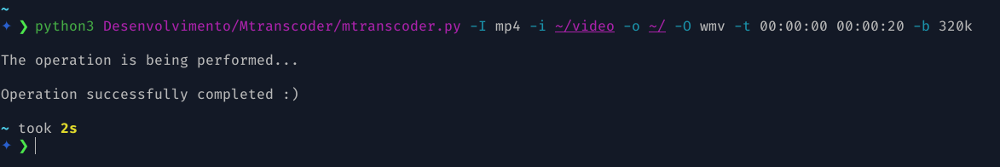

# Python 3 script for __converting__ and __extracting__ media - __CLI__


***

## __Features__:
* Convert videos

* Converts audios

* Extracts audios from videos
#

## __Supported and tested formats__:

|*Áudio*|*Vídeo*|
|:----: |:-----:|
| MP3   |  MP4  | 
| OGG   |  MKV  | 
| FLAC  |  WMV  |
| AAC   |   

#

## __Dependencies__:
## __[FFmpeg](https://www.ffmpeg.org/)__

installation on Fedora:
```
sudo dnf install https://download1.rpmfusion.org/free/fedora/
rpmfusion-free-release-$(rpm -E %fedora).noarch.rpm -y &&
sudo dnf install ffmpeg -y 
```

installation on Ubuntu / Debian and derivatives:
```
sudo apt install ffmpeg -y
```

installation on Manjaro:
```
sudo pamac install ffmpeg -y
```

## __Downloading project__:
```
git clone https://github.com/Pbezerra-dev/Mtranscoder.git
```
#

## __Using program__:
* Arguments are defined via the command line
```
python3 mtranscoder module path and arguments and their parameters

doubts: python3 module path mtranscoder -h
```
#

## __Project Image__:


