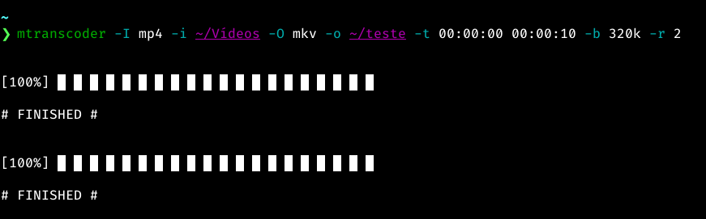

# Python 3 script for __converting__ and __extracting__ media - __CLI__

[](https://travis-ci.org/Pbezerra-dev/Mtranscoder)


***

## __Features and tested formats__:

*__Functions__* |  Convert videos | Converts audios | Extracts audios from videos 

***

*__Áudio__* | MP3 | OGG | FLAC | AAC |

*__Vídeo__* | MP4 | MKV | WMV | AVI | MOV | 3GP | WEBM | VOB | FLV | WMA

#   

## __Dependencies__:

## __[FFmpeg](https://www.ffmpeg.org/)__

installation on Fedora:
```
sudo dnf install https://download1.rpmfusion.org/free/fedora/
rpmfusion-free-release-$(rpm -E %fedora).noarch.rpm -y &&
sudo dnf install ffmpeg -y 
```

installation on Ubuntu / Debian and derivatives:
```
sudo apt install ffmpeg -y
```

installation on Manjaro:
```
sudo pamac install ffmpeg -y
```

## __How to contribute to the project__:
```
git clone https://github.com/Pbezerra-dev/Mtranscoder.git
cd Mtranscoder
python3 -m venv .venv
source .venv/bin/activate
```
* There are no third party packages, just builtins

## __To install on the system and update (Linux)__:

* install
```
./up_install.sh
```
* update
```
git pull origin master
./up_install.sh
```
* Provide the password and have the program installed or update

#

## __Using program__:
* _Arguments are defined via the command line_

* if not installed
```
python3 mtranscoder module path and arguments and their parameters
```
* if you have installed

```
mtranscoder arguments and their parameters
```

#

## __Project Images__:

